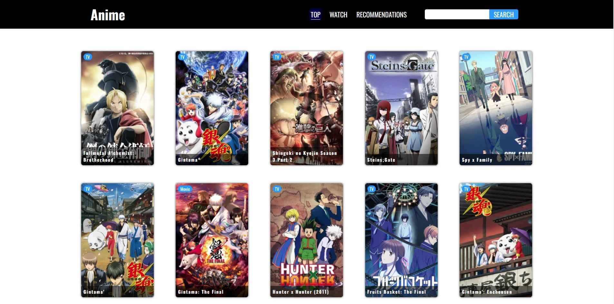
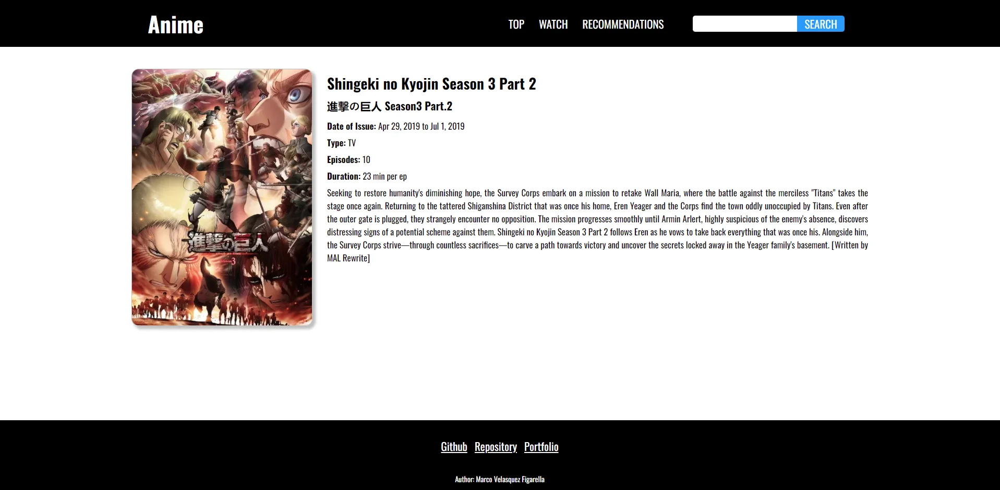
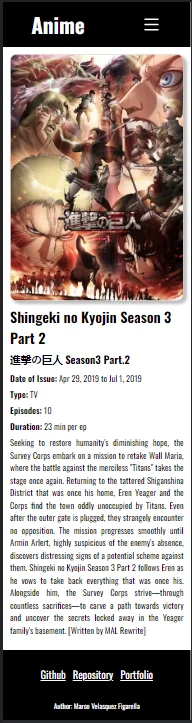

# `AnimeApiRest`

Ejercicio de consumo de Api, desarrollo Responsive y Mobil First.

Diseño web propio, se hizo simple para facilitar el desarrollo.

Hooks usados, useState y useEffect, no fue necesario el uso de useContext ni de useReducer.

Origen de API: https://jikan.moe/

## Click para ver [Demo](https://marco90v.github.io/animeApiRest/)

### `Desarrollo: `
* React
* React Router
* Fetch
* HTML
* CSS
* Grid
* Flexbox
  
### `Vistas:`
* Top - Lista de Animes en orden alfabético, con tipo(TV|Movie) y Nombre.
* Wacth - Ultimas Visualizaciones, con Numero de Episodio y Nombre.
* Recommendations - Recomendaciones de otros usuarios.
* Details - Detalles del Anime.
* Search - Búsqueda por nombre.
* NoMatch - Rutas no definidas (404).

### `Componentes:`
* Header
* Footer
* Card
* Spinner
* Pagination

### `Capturas:`

### `yarn start`

Runs the app in the development mode.\
Open [http://localhost:3000](http://localhost:3000) to view it in your browser.

The page will reload when you make changes.\
You may also see any lint errors in the console.

### `yarn build`

Builds the app for production to the `build` folder.\
It correctly bundles React in production mode and optimizes the build for the best performance.

The build is minified and the filenames include the hashes.\
Your app is ready to be deployed!

See the section about [deployment](https://facebook.github.io/create-react-app/docs/deployment) for more information.
